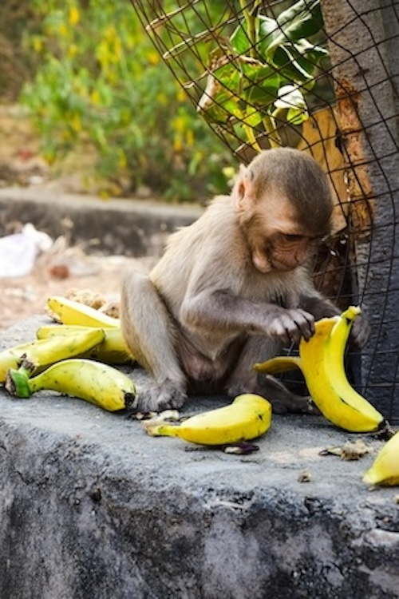

# Monkey Food Simulator (Simulador de comida para monos)

|                                                                                                                                                                                                                                                                               |                                                                      |
| ----------------------------------------------------------------------------------------------------------------------------------------------------------------------------------------------------------------------------------------------------------------------------- | -------------------------------------------------------------------- |
| En el siguiente proyecto se simulará, con el uso de multihilos, una situación donde se produce comida para monos, como plátanos y otras frutas, por parte de turistas que actúan como hilos productores, mientras que los monos consumen esta comida como hilos consumidores. |  |
