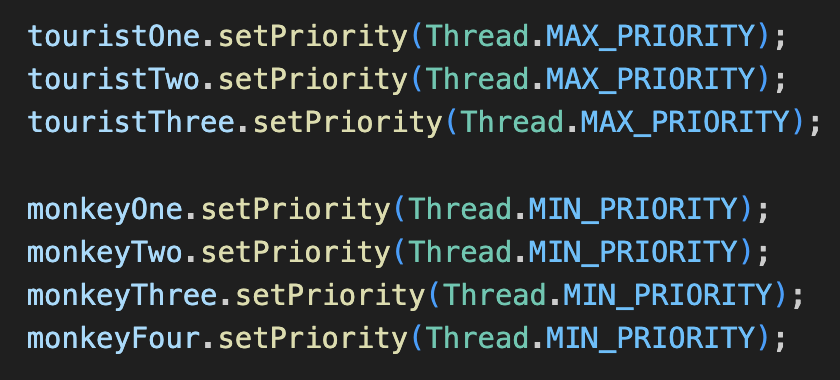
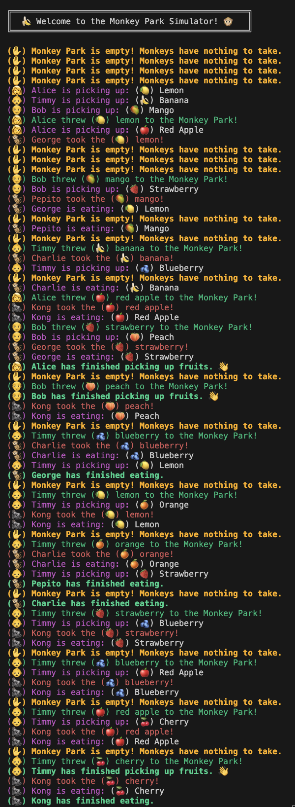

# Monkey Food Simulator (Simulador de comida para monos)

## a) Establece prioridades más altas para los hilos de los productores.

Como observamos en la imagen superior, he establecido prioridad máxima a todos los hilos productores, mientras que he establecido prioridad mínima a todos los hilos consumidores.

TEÓRICAMENTE, esto debería hacer que los hilos productores tengan más tiempo de CPU y, por lo tanto, produzcan más rápido, mientras que los hilos consumidores deberían consumir más lentamente debido a su menor prioridad.

SIN EMBARGO, en la práctica, el sistema operativo no garantiza un comportamiento estrictamente basado en las prioridades de los hilos. Otros factores, como la planificación del sistema operativo y la carga general del sistema, pueden influir en el rendimiento. Por lo tanto, el resultado real puede no coincidir completamente con lo esperado teóricamente.

## b) ¿El resultado es similar al caso en el que hacemos los tiempos de producción más cortos? Muestra una captura del output de la consola.

<table>
    <tr>
        <td style="min-width: 300px;">
            
        </td>
        <td>
            Aunque hemos modificado las prioridades de los hilos, el sistema operativo no garantiza un cumplimiento estricto de estas. En un chip M1, como el que utilizo, la presencia de núcleos de alto rendimiento y alta eficiencia puede influir en la planificación de tareas, distribuyéndolas de manera distinta a lo esperado.  
               
               
            Esto implica que los hilos con menor prioridad aún pueden recibir tiempo de CPU si los núcleos de alto rendimiento están ocupados, lo que puede alterar los resultados previstos.  
               
               
            Por esta razón, mientras que en el Experimento Dos (donde los tiempos de trabajo de los turistas son significativamente más cortos que los de los monos) los hilos productores completan sus tareas más rápidamente, en este Experimento Tres la diferencia en el comportamiento no es tan evidente.
        </td>
    </tr>
</table>
