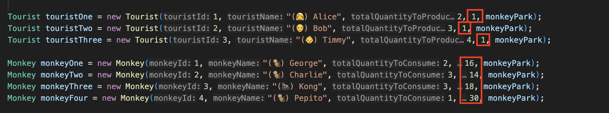
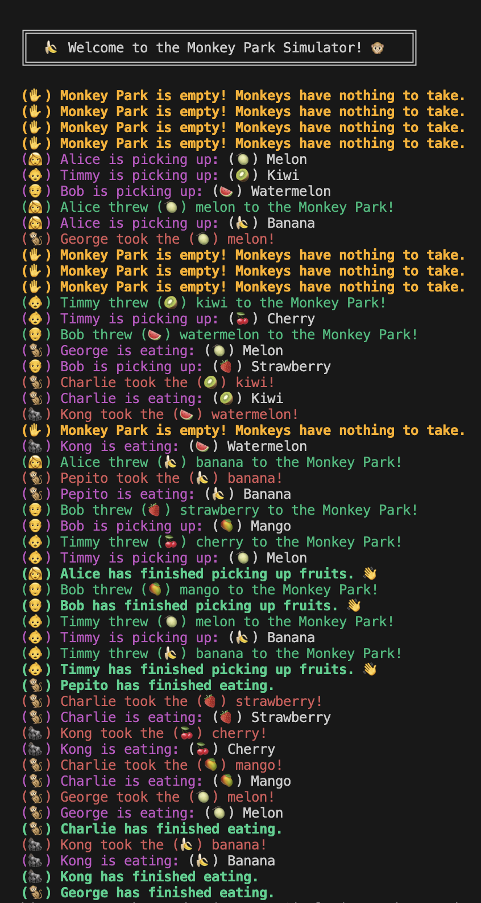
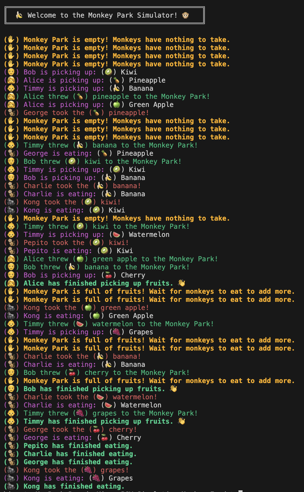

# Monkey Food Simulator (Simulador de comida para monos)

## Experimento Dos

### a) Cambia los parámetros de tiempo de producción y hazlos más cortos que los del tiempo en el que el cliente consume los productos.

Como observamos en la captura superior de la clase [App](./src/App.java), he modificado drásticamente en la construcción de los turistas y monos el tiempo máximo que tardan en producir y consumir la fruta. De esta manera, los turistas tardarán máximo 1 segundo en producir fruta, y los monos máximo entre 14 y 30 segundos, según el mono.

| **b) Muestra una captura del output de la consola.**                            | **c) ¿Observas algún cambio en la salida?**                                                                                                                                                                                                                                                                                                                                                                                                                                                                                                                                                                                                                                                                                                                                                                                                                                                                                                                                                                                                                                                                                                                                                                                 |
| ------------------------------------------------------------------------------- | --------------------------------------------------------------------------------------------------------------------------------------------------------------------------------------------------------------------------------------------------------------------------------------------------------------------------------------------------------------------------------------------------------------------------------------------------------------------------------------------------------------------------------------------------------------------------------------------------------------------------------------------------------------------------------------------------------------------------------------------------------------------------------------------------------------------------------------------------------------------------------------------------------------------------------------------------------------------------------------------------------------------------------------------------------------------------------------------------------------------------------------------------------------------------------------------------------------------------- |
|  | Sí, al observar la salida por consola, notamos que los turistas producen fruta más rápido de lo que los monos pueden consumirla.   En primer lugar, destacamos como se da en `mucho menos el mensaje de espera hacia los monos`, que anteriormente salía tanto. Pues ahora los monos tienen que esperar mucho menos, ya que la fruta se produce más rápido de lo que ellos tardan en terminar de comer.   Por eso mismo, observamos como los turistas terminan mucho antes que los monos en producir todas las frutas que se les ha indicado: `El último turista en terminar, termina antes que el primer mono en hacerlo.`   Además, los monos consumen de manera más espaciada, lo que genera `pausas más largas entre los mensajes de consumo de un mismo mono`.   Finalmente, he de destacar que la capacidad actual del parque es bastante amplia en relación a la cantidad de fruta que se produce (capacidad de 5, y se producen 9 en total). Por lo tanto, no se está provocando que se acumule un excedente de fruta en el sistema. Sin embargo, si reducimos la capacidad de frutas del parque podremos ver varios mensajes notificando a los turistas que esperen para lanzar más fruta. |

### He aquí un ejemplo con una capacidad de sólo 2 frutas. El resto de parámetros son iguales:

Claramente, observamos la aparición de la notificación de que el parque está lleno de frutas, repetidas veces.

