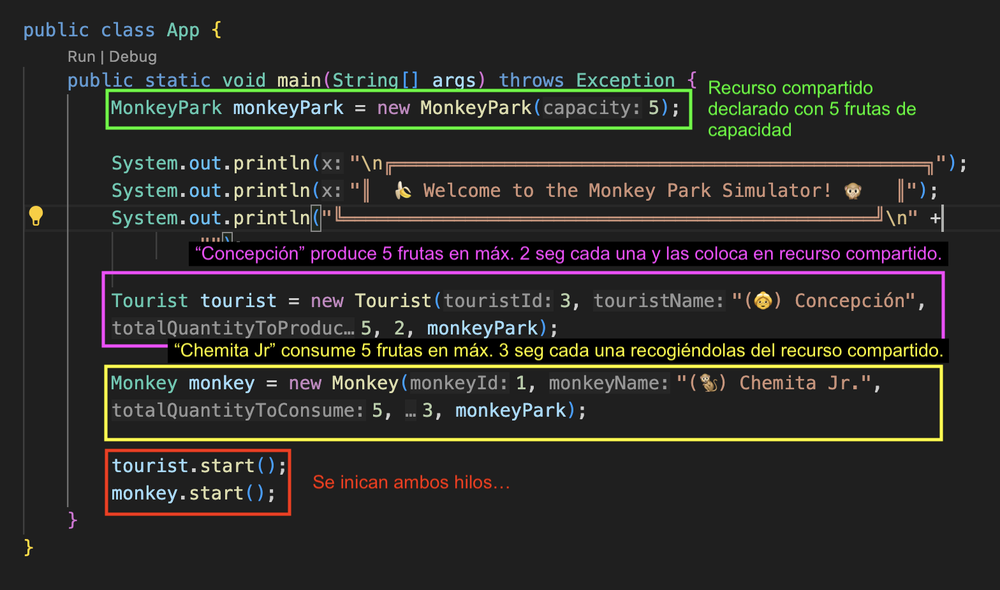
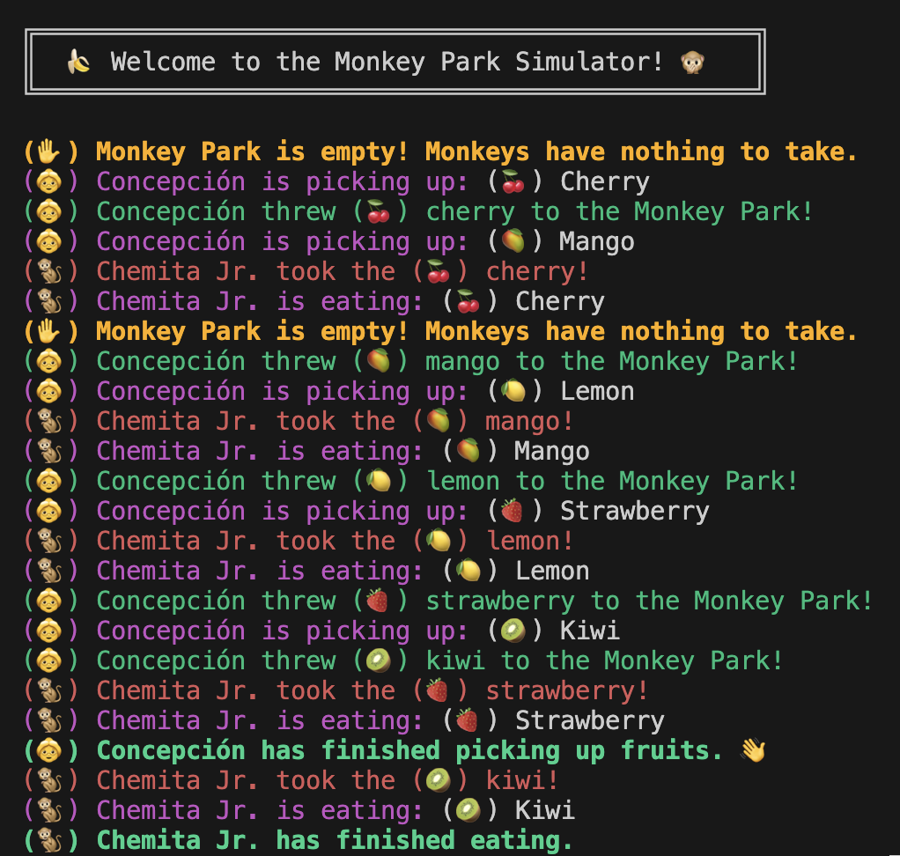

# Monkey Food Simulator (Simulador de comida para monos)

## Experimento Uno

### a) Crea un único productor y un consumidor.

### b) El productor producirá cinco productos, y el consumidor los consumirá todos.

Como observamos en la imagen superior, he creado como productora (turista) a Concepción, y como consumidor (mono) a Chemita Jr.

A ambos indico a través del constructor que producirán/consumirán 5 productos, o mejor dicho, frutas.

Respecto al resto de código que vemos en la imagen:

- En `verde` observamos en primer lugar la inicialización del recurso compartido (Parque de Monos) al que accederán ambos hilos. He optado por una capacidad de 5 pero podría modificarse sin problema. En el caso de ser menor, podrían los hilos tener que esperar para realizar operaciones en el recurso. Pero no sería un impedimento.

- En `rosa` está la construcción de Concepción, quien tiene un id '3' y producirá 5 frutas. Como tiempo máximo, tardará 2 segundos en producir cada una de estas frutas.

- En `amarillo`, color del plátano, tenemos la construcción del mono Chemita Jr con id '1'. Este mono comerá todas las frutas de Concepción (5) y tardará máximo 3 segundos en comer cada una de ellas.

- Finalmente, en `rojo`, se levantan estos hilos para que inicien su funcionamiento.

### c) Muestra una captura del output de la consola y explica con tus palabras el funcionamiento y ejecución del código añadiendo las capturas que consideres oportunas.

El código simula un parque de monos donde dos hilos principales interactúan: uno representa a "Concepción", quien recoge frutas y las lanza al parque, y otro representa a "Chemita Jr.", quien toma las frutas del parque y las consume.

**Funcionamiento y ejecución del código:**

1. **Inicialización:** El programa comienza con un mensaje de bienvenida al simulador del parque de monos.
2. **Interacción entre hilos:**
   - El hilo de "Concepción" recoge frutas de manera secuencial y las lanza al parque. Esto se refleja en los mensajes como "Concepción is picking up: (🍒) Cherry" y "Concepción threw (🍒) cherry to the Monkey Park!".
   - El hilo de "Chemita Jr." toma las frutas disponibles en el parque y las consume, como se observa en los mensajes "Chemita Jr. took the (🍒) cherry!" y "Chemita Jr. is eating: (🍒) Cherry".
3. **Sincronización:** Cuando el parque está vacío, el hilo de "Chemita Jr." espera hasta que "Concepción" lance nuevas frutas. Esto se indica con el mensaje "Monkey Park is empty! Monkeys have nothing to take.".

**Comportamiento de los hilos:**

- Los hilos están sincronizados mediante el uso de métodos sincronizados (`synchronized`) y el uso de los métodos `wait()` y `notifyAll()`. Esto asegura que "Chemita Jr." sepa que no puede tomar frutas cuando el parque está vacío y que "Concepción" espere si el parque está lleno antes de lanzar más frutas.
- La ejecución es intercalada debido a la naturaleza de los hilos y la sincronización. Esto significa que los hilos alternan sus acciones dependiendo de la disponibilidad de recursos en el parque y el tiempo de espera configurado para cada hilo.
- La sincronización evita condiciones de carrera y asegura que las operaciones en el recurso compartido (Parque de Monos) se realicen de manera segura y ordenada.

**Conclusión:**
El programa demuestra cómo los hilos pueden coordinarse para realizar tareas concurrentes. La sincronización evita condiciones de carrera y asegura que las acciones de cada hilo se realicen en el orden esperado.
